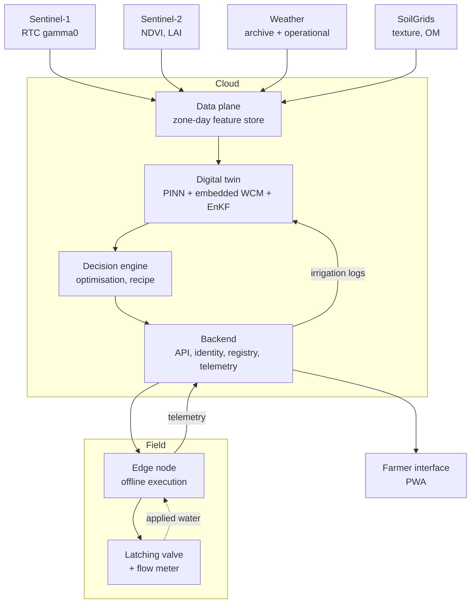
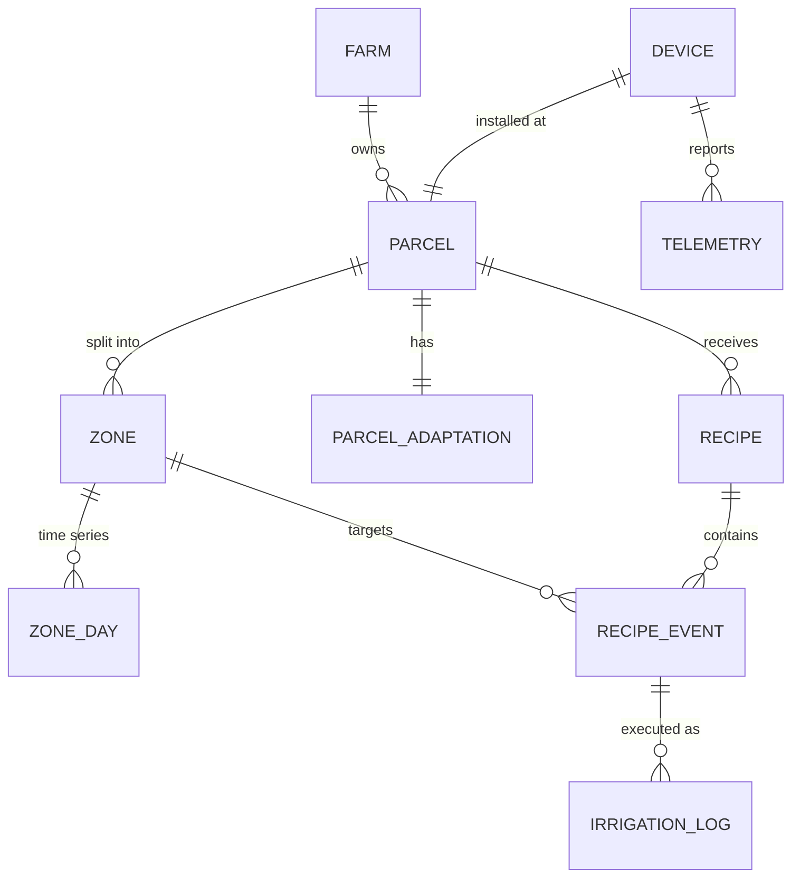
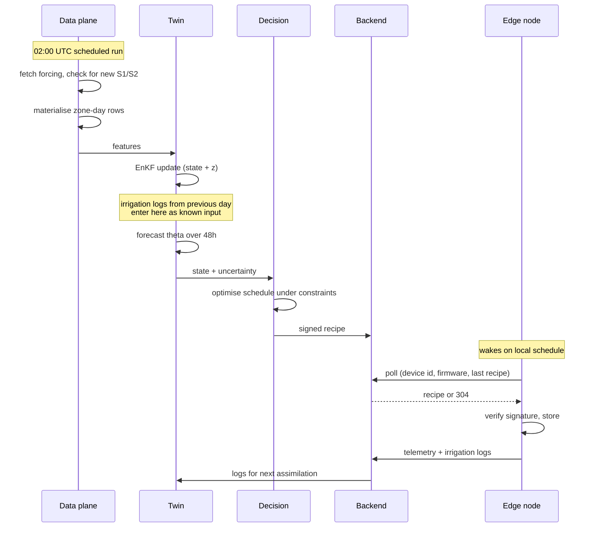
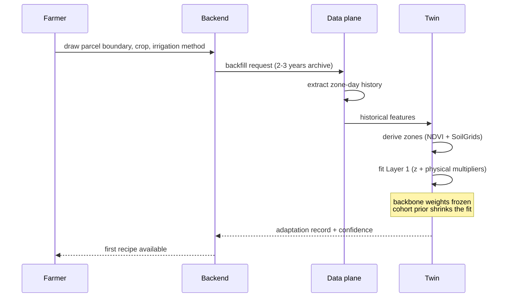
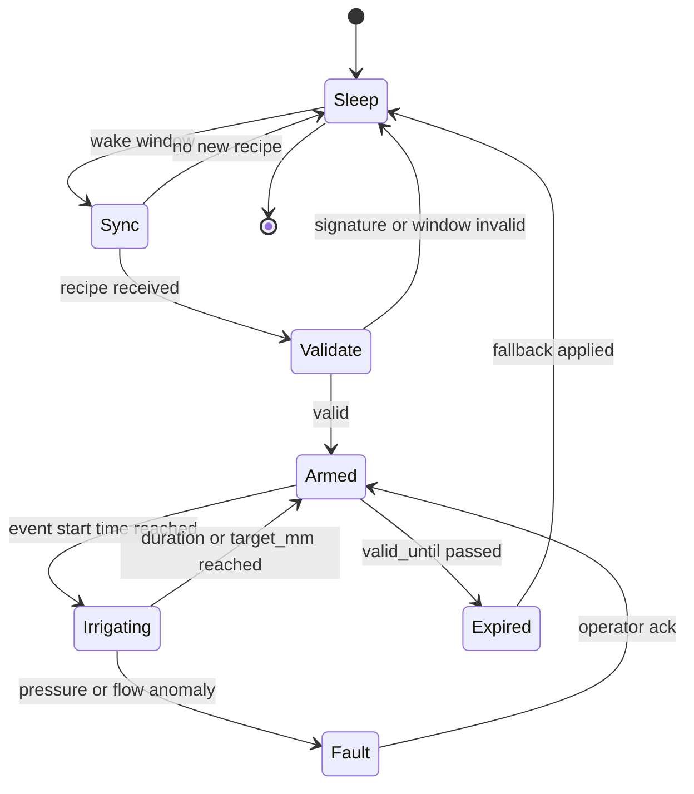
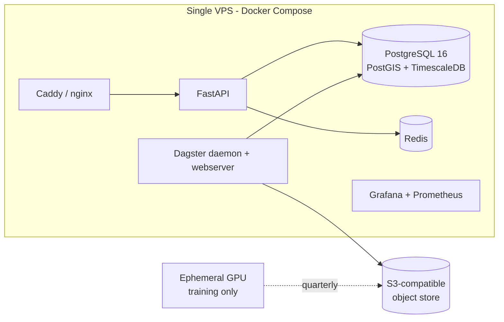

# System Architecture

Complete architecture for the zero-sensor agricultural digital twin and irrigation platform.

Module responsibilities live in `modules.md` and are not repeated here. Decisions and their
rationale live in `decisions/`. This document covers structure, contracts, flows, and
failure behaviour.

---

## 1. Principles

**Zero-sensor digital twin.** Soil state is modelled from remote sensing and meteorology
rather than measured in-field.

> "Zero-sensor" is not "no ground truth". The customer's field has no permanent probe;
> training is still anchored to external reference networks. Without that anchor the ubRMSE
> target is undefined.

**Physics-informed.** The loss embeds FAO-56 Penman-Monteith energy balance and 1D Richards
mass conservation.

**Cloud-compute / edge-actuate.** Heavy tensor work runs in the cloud and emits a light
24-48 hour JSON recipe. The edge node executes it offline against its local clock.

**Fail closed.** Every uncertainty resolves to "do not irrigate".

### Target metrics

| Metric | Target | Reference |
|---|---|---|
| ubRMSE | < 0.04 m3/m3 | ISMN stations |
| KGE | > 0.75 | ISMN / FluxNet |

Measurable only at reference station locations. Customer parcels are monitored indirectly
through the observation residual (section 9).

---

## 2. System context



**The two feedback edges are load-bearing.** Every irrigation event is a controlled wetting
experiment with a known input. That constrains Ks and theta_s far more strongly than passive
observation, so the system self-calibrates as it is used. If applied water is not measured,
this loop does not exist and the architecture loses its main compensation for having no soil
probe.

---

## 3. Core data model



### Entity notes

**PARCEL** — geometry (PostGIS), crop, irrigation method, planting date, cohort key.

**ZONE** — 2-4 per parcel, derived from multi-year NDVI plus SoilGrids. Refreshed annually,
**frozen within a season** or the time series breaks.

**ZONE_DAY** — the canonical ETL granularity. One row per zone per day: forcing, ET0, Kc,
gamma0 when a scene exists, LAI/fCover, quality flags. Everything downstream reads this
table and nothing else.

**PARCEL_ADAPTATION** — the Layer 1 fit: latent vector `z`, `Ks_mult`, `theta_s_offset`,
rooting depth, WCM `A`/`B`, cohort key, fit timestamp, residual statistics. **This is data,
not code** — that is what makes version management tractable.

**IRRIGATION_LOG** — the feedback record: commanded duration, actual duration, actual volume,
pressure samples, abort reason. Written by the edge node, consumed by the twin.

---

## 4. The recipe contract

The single most important interface in the system: it crosses the cloud/edge boundary, it is
executed offline, and both sides version independently. Treat it as a public API from day one.

```json
{
  "schema_version": "1.0",
  "recipe_id": "01J9X2...",
  "parcel_id": "prc_8821",
  "issued_at": "2026-08-18T02:10:00Z",
  "valid_from": "2026-08-18T00:00:00Z",
  "valid_until": "2026-08-20T00:00:00Z",
  "confidence": "normal",
  "fallback_policy": "no_irrigation",
  "zones": [
    {
      "zone_id": "z1",
      "events": [
        {
          "start_utc": "2026-08-18T02:30:00Z",
          "duration_s": 5400,
          "target_mm": 12.0,
          "priority": 1
        }
      ]
    }
  ],
  "constraints": {
    "max_concurrent_zones": 1,
    "min_pressure_kpa": 150,
    "max_daily_mm": 20
  },
  "signature": "ed25519:..."
}
```

### Rules

- **`duration_s` is what the device executes. `target_mm` is intent only** — carried so the
  device can abort early if the flow meter reaches target, and so telemetry can report the
  gap. The device never computes duration itself.
- **`valid_until` is absolute.** Past it, the device applies `fallback_policy` — which is
  always `no_irrigation` unless a deliberate exception is documented.
- **`confidence: low`** means the twin flagged an anomalous residual. The decision engine
  already produced a conservative plan; the device does not reinterpret it, but the interface
  surfaces it to the farmer.
- **Signed.** The device verifies before executing. An unsigned or stale recipe is discarded,
  not executed.
- **Additive schema evolution only.** Fielded devices will run old firmware for years.

---

## 5. Daily cycle



The device **polls**; the cloud never pushes. A battery node that wakes once or twice a day
cannot hold a persistent session.

---

## 6. Onboarding



**No cold start.** The fit runs against retrospective satellite archive at signup, so the
farmer does not wait a season. This is the practical payoff of partial pooling
(`decisions/pooling-strategy.md`).

---

## 7. Edge node state machine



- `Fault` closes the valve first, then records. Never the reverse.
- `Expired` applies `fallback_policy`, which is no irrigation. It does not repeat the last
  known schedule.
- Local clock is UTC plus an explicit offset. No baked-in local time even though the
  deployment region has no DST.

---

## 8. Degradation ladder

The system must fail progressively, never all at once. Each level is a defined, testable
state — not an error path.

| Level | Trigger | Behaviour |
|---|---|---|
| **L0 Normal** | Fresh forcing, recent S1, residual nominal | PINN + assimilation, full recipe |
| **L1 Stale observation** | No usable S1 for > 14 days | Uncertainty widened, recipe conservative |
| **L2 Low confidence** | Persistent systematic residual on this parcel | Fall back to bucket model, flag to farmer |
| **L3 Twin unavailable** | Model service down or inference failure | Bucket model recipe, full duration |
| **L4 No forcing** | Weather source unreachable | Serve last recipe until `valid_until`, then stop |
| **L5 No connectivity** | Device cannot reach backend | Execute stored recipe, then `fallback_policy` |
| **L6 Hardware fault** | Pressure/flow mismatch, valve feedback missing | Close valve, alert, require acknowledgement |

L2 and L3 are why the FAO-56 bucket model is a permanent component rather than a Phase 1
scaffold (`decisions/development-phases.md`).

---

## 9. Anomalous parcel detection

The backbone continuously monitors `sigma0_predicted - sigma0_observed` per parcel. A
persistent, systematic residual means the parcel contains something the backbone cannot see:
shallow bedrock, salinity, a high water table, a drainage fault.

The system does not quietly predict wrong. It **declares itself low-confidence** (level L2),
the recipe becomes conservative, and the farmer is prompted to consider a one-off soil
analysis for that parcel.

This is the mechanism that keeps a zero-sensor architecture honest. Having no probe does not
mean not measuring uncertainty.

---

## 10. Deployment topology



- **No Kubernetes.** One VPS until a real scaling problem appears.
- **GPU is ephemeral.** Rented for training runs, not kept running. Daily inference is CPU.
- **Object store and compute in the same region.** Cross-cloud egress exceeds compute cost
  (`cost-model.md`).
- Storage sizing follows zone-day granularity, not raw scenes.

---

## 11. Security and data boundaries

| Boundary | Control |
|---|---|
| Device to backend | Per-device credential, TLS, signed recipes verified on device |
| Recipe authenticity | Ed25519 signature; unsigned or expired recipe is discarded |
| Farmer data | Parcel geometry is personally identifying in practice — treat as personal data |
| Third-party data | Satellite and weather sources are read-only; no credentials leave the backend |
| Actuation | No remote path exists that opens a valve without a signed, in-window recipe |

There is deliberately **no remote "open valve now" command**. Manual override happens on the
device or through a recipe. This removes an entire class of compromise from the threat model.

---

## 12. Unresolved slots

These are real holes in this document, not oversights. Filling them requires decisions in
`open-decisions.md`.

| Slot | Blocked on |
|---|---|
| `IRRIGATION_LOG` volume field semantics | Applied-water measurement method |
| BOM and telemetry schema | Applied-water measurement method |
| Cohort key definition in `PARCEL` | Cohort granularity, target cropping pattern |
| `PARCEL_ADAPTATION` field list | Adaptation parameterisation |
| Assimilation implementation | Online update method |
| Training/inference forcing alignment | Domain shift remedy |

**Applied-water measurement is the blocking one.** It appears in the data model, the recipe
contract, the telemetry schema, the BOM, and the self-calibration loop. The data plane schema
cannot be finalised until it is settled.
